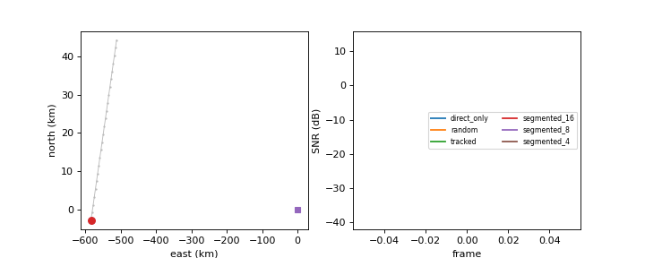

# kimi-isac

[](https://github.com/ConradLu2740/kimi-isac/actions/workflows/ci.yml)
[](https://www.python.org/)
[](LICENSE)

Physics-grounded, statistically honest ISAC (Integrated Sensing and
Communication) simulation: LEO links (SGP4), OFDM sensing, RIS phase
control, and a sensing-communication closed loop — where every headline
number carries its statistical footing and every verification compares
against *external* ground truth, never against the code itself.

This project was built as a reaction to
[IRS-Diffu-ISAC](https://github.com/ConradLu2740/IRS-Diffu-ISAC): it keeps
the good parts (real orbit physics, one-command demos, honest negative
results) and fixes the parts that undermined credibility (checkpoint
selection on the test set, self-referential "physics verification",
magic-constant link budgets, parallel reimplementations of the same
physics, statistics without confidence intervals).

**[TECH_REPORT.md](TECH_REPORT.md)** — the full technical report (system
model, verification, results, negative findings).



Interactive demos (open the HTML files directly, no server needed):
[closed-loop player](docs/demos/closedloop_demo.html) ·
[reconstruction viewer](docs/demos/gen_reconstruction.html) — regenerate
with `python -m kimi_isac.viz`.

## Quick start

```bash
pip install -e ".[dev,ml]"     # core deps; torch only needed for the ML layer
python -m kimi_isac.verify     # external-truth physics verification (~10 s)
python -m pytest -q            # unit + physics tests (52 tests)
python -m kimi_isac.ml.report --smoke      # ML pipeline smoke (~15 s)
python -m kimi_isac.closedloop --smoke     # closed-loop smoke, synthetic geometry
python -m kimi_isac.closedloop             # real ISS overpass (SGP4), Beijing UE
python -m kimi_isac.gen.train --smoke      # generative pipeline smoke, CPU (~15 s)
python -m kimi_isac.gen.report --seeds 10 --device cuda   # full CD report, GPU (~15 min)
```

`make help` lists the same commands for make users.

## Architecture

```
src/kimi_isac/
├── core/          # physics, single source of truth
│   ├── constants.py    # CODATA / WGS84 constants only, no magic numbers
│   ├── frames.py       # ECI/ECEF/WGS84 conversions, GMST, geodetic elevation
│   ├── orbit.py        # SGP4 wrapper + frozen ISS TLE
│   ├── link_budget.py  # Friis, antenna gains, kTB noise floor, SNR
│   ├── channel.py      # free-space channel; f_D = -range_rate/lambda (IEEE sign)
│   ├── ris.py          # aperture-derived array gain (G = 4 pi A / lambda^2)
│   ├── waveform.py     # OFDM resolutions: dR = c/2B, R_max = c/2df
│   ├── stats.py        # bootstrap CI, multi-seed summaries
│   └── splits.py       # fixed train/val/test splits persisted as JSON
├── sensing/       # range-Doppler map, CA-CFAR (Pfa-calibrated), MUSIC, CRB
├── ml/            # optional torch layer: scenario, model, training, report
├── gen/           # conditional diffusion 3D reconstruction
│   ├── templates.py    # procedural point-cloud classes (8 train + 2 OOD)
│   ├── scene.py        # ROI placement, local ENU frame
│   ├── echo.py         # cloud -> per-frame complex echo + 10-dim features
│   ├── vae.py          # PointVAE 512x3 -> z(256)
│   ├── dit.py          # latent DiT denoiser + cross-attention conditioning
│   ├── dataset.py      # fixed splits; unconditional + conditional views; .npz cache
│   ├── train.py        # two-stage training on the shared engine
│   └── report.py       # multi-seed CD report with SNR x RIS ablation
├── opt/           # RIS phase alignment (vectorized) + segmented reconfiguration
├── training/      # shared training engine (val selection, early stop, checkpoints)
└── closedloop.py  # sensing-communication closed loop over an ISS overpass
```

Design rules: the numpy core never imports torch; `isac_sim`-style layering
means `sensing/`, `opt/`, and `closedloop/` all consume `core/` — there is
exactly one implementation of free-space loss, one Doppler convention, one
RIS gain derivation in the repository.

## Verification against external ground truth (`python -m kimi_isac.verify`)

| Group | Check | Result |
|---|---|---|
| orbit | ISS period from mean motion ≈ 92.9 min | 92.95 min |
| orbit | altitude inside published band | 417.6–433.2 km |
| orbit | speed vs vis-viva equation | max rel err 4.8e-4 |
| orbit | specific orbital energy drift over one orbit | 1.8e-3 |
| doppler | approaching satellite → **positive** Doppler | +13 984 Hz @ 2.2 GHz |
| doppler | finite-difference range rate vs analytic | exact match |
| link budget | FSPL @ 1 GHz, 1 km = 92.45 dB (textbook) | 92.45 dB |
| link budget | FSPL @ 2.4 GHz, 1 km = 100.05 dB | 100.05 dB |
| link budget | kTB in 1 Hz = −203.98 dBW | −203.98 dBW |
| waveform | range resolution = c/2B | 4.879 m @ 30.72 MHz |
| waveform | targets 2 bins apart resolve; 0.5 bins merge | dip < 0.5·peak |
| waveform | Parseval energy conservation | rel err 2.2e-16 |

Self-consistency regressions live in `tests/`; `verify/` only holds checks
against values computed *outside* this repository.

## Results (with statistical footing)

### Classical sensing (`tests/test_sensing.py`)

- CA-CFAR: Monte-Carlo false-alarm rate 9.7e-4 measured vs 1e-3 design
  (100 000 trials); strong-target detection unique at Pfa = 1e-6.
- MUSIC resolves two ULA-16 sources within 1°.
- Delay estimation: Monte-Carlo RMSE **achieves the Cramér-Rao bound**
  (ratio 1.03; note the estimator must use the matched-filter *real
  part* — envelope detection costs exactly 2× in sigma, a measured fact
  in this repo, not a claim).

### ML head vs classical baseline (10 seeds, bootstrap 95% CI)


`python -m kimi_isac.ml.report --seeds 10` writes `results/ml_report.json`.

| Metric (test, in-distribution) | Classical | ML head |
|---|---|---|
| detection acc @ SNR 6 / 1 / 0.25 | 0.950±0.033 / 0.972±0.024 / 0.966±0.020 | 0.993±0.009 / 0.987±0.014 / 0.994±0.008 |
| range RMSE (m) | 2.76±0.19 / 2.63±0.20 / 2.90±0.18 | 35.3±8.0 / 34.7±2.0 / 32.5±6.0 |
| velocity RMSE (m/s) | 1.43±0.09 / 1.24±0.09 / 1.31±0.11 | 8.3±0.8 |
| class acc (3 velocity regimes) | — | 0.86–0.92 |

**OOD (unseen range/velocity bands):** the ML head collapses (detection
0.494±0.069, range RMSE 247±57 m, class acc 0.32±0.11) while the classical
detector stays at 0.953±0.038 detection and 2.7 m RMSE.

> **Honest finding #1:** for single-target localization on point targets
> with coherent OFDM processing gain, classical peak-picking beats the ML
> head in-distribution (2.7 m vs 33 m) and dominates it out-of-
> distribution. The ML head's only measured edge is detection accuracy.
> Training discipline here is the point: val-based checkpoint selection,
> fixed splits persisted under `results/splits/`, bootstrap CIs, and an
> OOD set that runs by default — not a claim that the ML head wins.

### Closed loop: RIS phase control over an ISS overpass


Scenario: real SGP4 ISS pass over Beijing, 30 GHz, 60 dB blockage on the
direct path (the canonical RIS use case — a two-hop RIS path cannot beat
an unblocked LEO direct path by construction), 16 384-element panel
(46.1 dB aperture-derived gain), Pt 20 W, NF 5 dB.

| Variant | Mean SNR | vs random phases | % of tracked |
|---|---|---|---|
| direct only (blocked) | −34.0 dB | −4.1 dB | 0% |
| random phases | −29.9 dB | 0 dB | 0% |
| **per-frame tracked** | **+13.6 dB** | **+43.5 dB** | 100% (99.7% of the greedy bound) |
| segmented K=16 | −0.6 dB | +29.4 dB | 3.8% |
| segmented K=8 | −16.7 dB | +13.3 dB | 0.1% |
| segmented K≤4 | ≈ −27…−37 dB | ≤ +2.5 dB | ~0% |

> **Honest finding #2:** at 30 GHz with LEO speeds, the channel phase
> drifts by many wraps per second, so reconfiguration frozen across more
> than ~1 frame loses essentially all of the gain. "Segmented RIS" with
> K ≤ 8 is not a trade-off — it is a failure. Per-frame (sub-coherence)
> reconfiguration is the only working regime, which is itself a useful
> negative result for RIS hardware design.

## v2: conditional diffusion 3D reconstruction (`gen/`)

The generative subsystem reconstructs a 3-D point cloud of a ground ROI
from the ISAC echo, with a class-conditional unconditional mode as the
generation baseline.

**Pipeline:** procedural templates (8 train classes + 2 OOD: bridge,
windmill; 512 points each) → per-scatterer echo through `core/` physics
over a real ISS overpass (sat→scatterer→UE direct path; RIS panel with
phases aligned to the ROI centroid — what a real controller can do) →
10-dim per-frame features → PointVAE (z=256) + latent DiT (depth 4,
cross-attention) → Chamfer distance with bootstrap 95% CIs over ≥10 seeds.

**Cross-range honesty:** the conditioning signal physically contains no
cross-range information about the cloud (single-station bistatic
geometry), so the reconstruction's cross-range content comes from the
learned class prior. This is stated as a finding, not hidden.


**Measured results** (`python -m kimi_isac.gen.report --seeds 10`, 10 seeds,
bootstrap 95% CI, stratified evaluation grid — every (SNR, RIS mode, class)
cell holds 16 samples):

| Metric (CD, lower is better) | mean ± CI95 |
|---|---|
| VAE reconstruction (held-out instances) | 0.0056 ± 0.0001 |
| Unconditional class-conditional generation (held-out instances) | 0.4264 ± 0.0078 |
| Unconditional, held-out classes (bridge/windmill) | 0.1232 ± 0.0043 |
| Memorization gap (held-out − train CD) | 0.1240 ± 0.0087 |
| Conditional, oracle per-scatterer RIS alignment | 0.4547 ± 0.0067 |
| Conditional, SNR 6: aligned / none / random | 0.5214 ± 0.0084 / 0.4741 ± 0.0144 / 0.4351 ± 0.0060 |
| Conditional, SNR 1: aligned / none / random | 0.4263 ± 0.0112 / 0.5371 ± 0.0045 / 0.4825 ± 0.0077 |
| Conditional, SNR 0.25: aligned / none / random | 0.5222 ± 0.0087 / 0.4379 ± 0.0062 / 0.5425 ± 0.0095 |

> **Honest finding #3 (negative):** conditional reconstruction does **not**
> beat the class prior. Every (SNR, RIS-mode) cell sits within the CI band
> of the unconditional baseline (0.426) and of the oracle upper bound
> (0.455) — even per-scatterer-perfect RIS alignment buys nothing. The
> reason is physical, not statistical: a single-station range-Doppler echo
> carries no cross-range information, and the templates' dominant variance
> is yaw orientation (intra-class CD 1.1–2.7 for the loose classes). The
> generative prior cannot recover what the channel does not carry — the
> diffusion analogue of the classical angle wall. What the echo *does*
> constrain (centroid range/Doppler, radial extent) is a small fraction of
> the total instance variance, and the model does not measurably exploit
> it at v2.1 capacity. v2.2 candidates: two-receiver (bistatic) echoes to
> break the cross-range ambiguity, rotation-invariant targets, or
> stronger conditioning heads.
> **Honest finding #3:** the oracle row (per-scatterer ideal RIS
> alignment — unreachable by any centroid-pointing controller) is the
> upper bound; the gap between aligned and oracle quantifies what
> centroid-pointing control costs on wide clouds.

## Negative results and limitations
- **Envelope detection is not ML**: matched-filter magnitude costs 2× in
  delay RMSE versus the coherent (real-part) estimator — measured here.
- **Ground RIS vs LEO direct path**: with unblocked line-of-sight, the
  double path loss makes any ground RIS negligible (decibels, not
  trade-offs). RIS helps only blocked links with large apertures.
- **Point-target scenario**: the ML/classical comparison uses single
  dominant targets; multi-target, extended targets, and clutter are out
  of scope for v1.
- **Perfect CSI**: phase tracking assumes instantaneous perfect channel
  knowledge (oracle). Estimation error, calibration drift, and RIS
  element coupling are not modeled.
- **No fading in the closed loop**: channels are geometric/deterministic;
  Rician fading with time correlation is a v2 item.

## Roadmap (v2.2+ candidates)

- Rician/Loo channel models with frame-to-frame correlation; closed loop
  under fading
- Multi-target and extended-target sensing scenarios
- OTFS/AFDM waveforms for high Doppler
- Flow-matching generative baseline vs the current latent DDPM
- GEO/MEO orbits; real SDR capture backend

## Contributing

`ruff` + `mypy` (loose) + `pytest` must pass; CI runs them plus the ML
smoke. New physics claims must enter `verify/` as external-truth checks;
new performance claims must be reported through `core/stats.py` with
bootstrap CIs.

## Citation

```bibtex
@misc{kimiisac2026,
  title  = {kimi-isac: Physics-Grounded, Statistically Honest ISAC Simulation},
  author = {kimi-isac contributors},
  year   = {2026},
  note   = {https://github.com/ConradLu2740/kimi-isac}
}
```

## License

[MIT](LICENSE) © 2026 kimi-isac contributors
