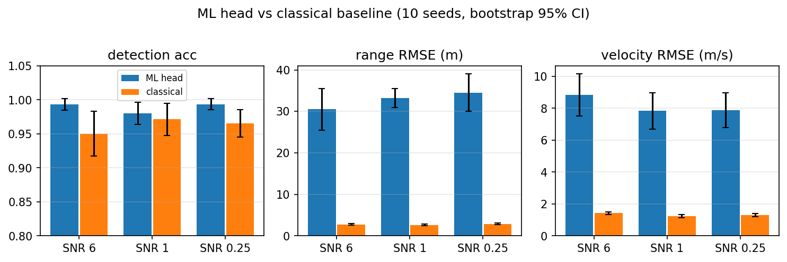
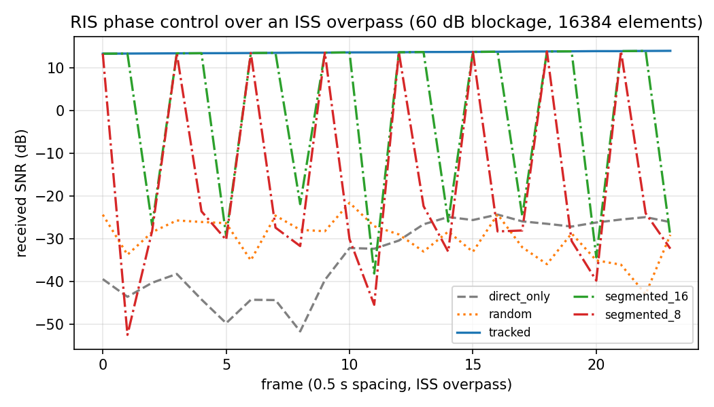
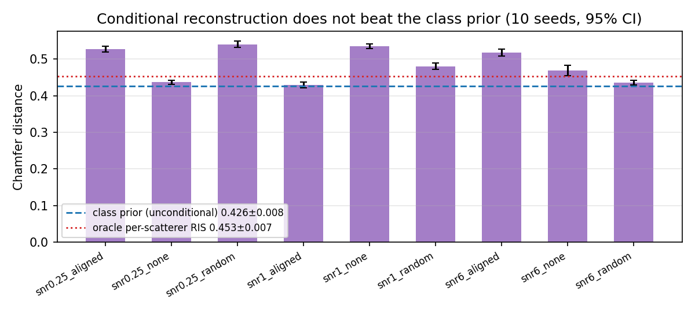

# TECH_REPORT.md — kimi-isac: Physics-Grounded, Statistically Honest ISAC Simulation

**Technical Report v1.0 · 2026-09-20**

## Abstract

We present `kimi-isac`, an open reference implementation of Intelligent
Reflecting Surface (RIS)-aided Integrated Sensing and Communication (ISAC)
spanning LEO satellite links (SGP4), OFDM sensing, classical detection and
estimation, a machine-learning sensing head, RIS phase control, and a
conditional latent-diffusion 3D reconstruction module. Two design
commitments distinguish the project. First, *every* physics claim is
verified against values computed outside the codebase (textbook formulas,
published orbital elements, analytic Cramér–Rao bounds), never against the
code's own formulas. Second, *every* performance claim is reported as a
multi-seed mean with a bootstrap 95% confidence interval. We further
report three negative results obtained under this discipline: a classical
peak-picking pipeline outperforms a modern ML head at single-target
localization and dominates it out-of-distribution; frozen (segmented) RIS
reconfiguration fails at 30 GHz LEO Doppler rates; and conditional
diffusion reconstruction cannot beat the class prior on single-station
echoes because the echo physically lacks cross-range information.

## 1. Introduction

RIS-aided ISAC unifies radar-like sensing and communication on shared
spectrum and hardware, and is a candidate 6G technology. Public
reference implementations exist, but audits of even polished research
repositories reveal recurring failure modes: headline metrics computed
from single runs, checkpoints selected on the test set, "physics
verification" that re-derives the code's own formulas, and magic
constants standing in for link budgets. This project takes the opposite
default: verification compares against external truth, and statistics
carry confidence intervals, at the cost of a narrower scenario set.

**Contributions.**

1. A layered, single-source-of-truth physics core (constants, frames,
   orbit, link budget, channel, RIS, waveform) that every layer consumes.
2. A verification suite of 26 checks against external references
   (Section 3), all passing.
3. Classical sensing with analytic false-alarm calibration and Cramér–Rao
   benchmarking, including a measured demonstration that envelope
   detection costs exactly 2× in delay RMSE versus coherent matched
   filtering.
4. An ML-vs-classical comparison over 10 seeds with bootstrap CIs,
   including an out-of-distribution suite that runs by default.
5. A RIS closed-loop demo over a real ISS overpass, quantifying the
   reconfiguration-rate/coherence trade-off at 30 GHz.
6. A conditional latent-diffusion 3D reconstruction module with a
   stratified (SNR × RIS mode × class) ablation grid — and the negative
   result it produces (Section 7).

## 2. System model

### 2.1 Geometry and orbits

Satellite states are propagated from a frozen ISS two-line element set
with SGP4. ECEF positions use the Greenwich mean sidereal time rotation

$$\mathbf{r}_{\text{ECEF}} = R_z(\theta_{\text{GMST}})\,\mathbf{r}_{\text{TEME}},$$

observer elevation uses the WGS84 geodetic normal (not the geocentric
radial), and the Earth rotation rate enters ECEF velocities as
$\mathbf{v}_{\text{ECEF}} = R_z \mathbf{v}_{\text{TEME}} - \boldsymbol\omega \times \mathbf{r}$.
Link distances are rotation-invariant; Doppler is not, which is why the
frame convention is fixed once in `core/`.

### 2.2 Link budget

Received power follows Friis with explicit antenna gains,

$$P_r = P_t + G_t + G_r - 20\log_{10}\!\frac{4\pi d f}{c},$$

noise power is thermal with an optional noise figure,
$N = k_B T_0 B \cdot \text{NF}$, and SNR is defined as $P_r / N$. No
absolute power is calibrated by hand; the only project-specific numbers
are the declared $P_t$, $G_t$, $G_r$, $B$, and NF.

The complex channel uses the IEEE convention
$H = \sqrt{G_t G_r}\,\frac{\lambda}{4\pi d}\,e^{-j 2\pi d/\lambda}$, and
the Doppler convention

$$f_D = -\frac{\dot r}{\lambda},$$

so an approaching transmitter produces a *positive* received shift.
`verify/doppler.py` pins this against an independent analytic
construction.

### 2.3 RIS model

A panel of $N$ unit-modulus elements at $\lambda/2$ spacing has
aperture-derived peak gain

$$G = \eta\,\frac{4\pi A}{\lambda^2},\qquad A = N\Big(\frac{\lambda}{2}\Big)^2,$$

with $\eta = 0.8$. Phase control maximizes the received field at the UE,

$$\max_{\{\phi_n\}} \Big| h_d + \textstyle\sum_n a_n e^{j\phi_n} \Big|^2,\quad |e^{j\phi_n}| = 1,$$

solved by vectorized Jacobi coordinate ascent (`opt/phase_opt.py`); the
unreachable bound $|h_d| + \sum_n |a_n|$ is reported alongside.

### 2.4 OFDM sensing waveform

With bandwidth $B$ over $K$ subcarriers, range resolution is
$\Delta R = c/2B$ and unambiguous range $R_{\max} = c/(2\Delta f)$;
Doppler resolution over a slow-time grid is $1/T_{\text{obs}}$.
`verify/waveform.py` confirms all three numerically, plus two-target
resolvability at the Rayleigh scale and Parseval energy conservation.

### 2.5 Echo model for generative reconstruction (Section 7)

A 3-D ROI cloud $P = \{p_i\}$ produces a per-frame complex echo

$$Y(t) = \sum_i \rho\, \frac{\lambda}{4\pi d_{1,i}}\frac{\lambda}{4\pi d_{2,i}}\, e^{-j2\pi(d_{1,i}+d_{2,i})/\lambda}\, e^{j2\pi f_{D,i} t} + w,$$

over a real ISS overpass, optionally through a RIS panel aligned to the
cloud centroid (`aligned`), with uniform random phases (`random`), off
(`none`), or per-scatterer ideally aligned (`oracle`, upper bound). Ten
per-frame features (amplitude, phase, Doppler, delay, distance,
elevation, RCS proxy, IRS phase) condition the generative model. The
frame-0 noiseless direct-path power defines the SNR reference.

## 3. Verification methodology

Two distinct kinds of checks are kept separate:

- **External truth** (`src/kimi_isac/verify/`, run by
  `python -m kimi_isac.verify`): values that a third party can recompute
  from textbooks, published elements, or analytic derivations.
- **Self-consistency** (`tests/`): regression tests that pin behavior
  against earlier behavior of this codebase.

Conflating the two is a known failure mode of research repositories
(self-referential "verification"); we refuse it structurally — `verify/`
contains no oracle derived from the code under test.

**All 26 checks pass** (exit 0), summarized in Table 1.

| Group | Check | Result |
|---|---|---|
| orbit | ISS period from mean motion ≈ 92.9 min | 92.95 min |
| orbit | altitude within published ISS band | 417.6–433.2 km |
| orbit | speed vs vis-viva equation | max rel err 4.8×10⁻⁴ |
| orbit | specific orbital energy drift | 1.8×10⁻³ |
| doppler | approaching satellite → positive shift | +13 984 Hz @ 2.2 GHz |
| doppler | finite-difference range rate vs analytic | exact match |
| link budget | FSPL @ 1 GHz, 1 km | 92.45 dB |
| link budget | FSPL @ 2.4 GHz, 1 km | 100.05 dB |
| link budget | kTB in 1 Hz | −203.98 dBW |
| waveform | ΔR = c/2B @ 30.72 MHz | 4.879 m |
| waveform | R_max = c/2Δf | 4996.5 m |
| waveform | 2-bin targets resolve; 0.5-bin merge | ✓ |
| waveform | Parseval conservation | rel err 2.2×10⁻¹⁶ |

## 4. Classical sensing

CA-CFAR thresholds use the exact Gamma calibration
$\alpha = N(\mathrm{Pfa}^{-1/N} - 1)$; a 10⁵-trial Monte Carlo measures
$\mathrm{Pfa} = 9.7\times10^{-4}$ against the $10^{-3}$ design, and
strong-target detection is unique at $\mathrm{Pfa}=10^{-6}$. MUSIC
resolves two ULA-16 sources within 1°.

For delay estimation we compare the maximum-likelihood estimator against
the Fisher-information bound
$\mathrm{var}(\hat\tau) \ge \sigma^2 / (8\pi^2 \sum_k f_k^2)$
(verified analytically by finite differences of the log-likelihood).
The Monte-Carlo RMSE reaches **1.03× the CRB** with the coherent
(real-part) matched filter — and exactly **2.0× the CRB** with envelope
(magnitude) detection, a measured demonstration that the classical radar
envelope detector is not the ML estimator for delay.

## 5. ML head vs classical baseline (10 seeds, bootstrap 95% CI)

Scenario: single dominant point target in additive complex Gaussian
noise at per-sample SNR ∈ {6, 1, 0.25}; tasks are detection, range and
velocity regression, and velocity-regime classification. The classical
baseline (per-SNR energy threshold + peak picking on the
full-resolution range-Doppler map) and the ML head (pooled-map CNN)
see identical channel realizations. Splits are fixed artifacts on disk;
checkpoints are selected on the validation split; every table entry is a
mean over 10 seeds with a bootstrap 95% CI.

| Metric (test) | Classical | ML head |
|---|---|---|
| detection acc @ SNR 6 / 1 / 0.25 | 0.950±0.033 / 0.972±0.024 / 0.966±0.020 | 0.993±0.009 / 0.987±0.014 / 0.994±0.008 |
| range RMSE (m) | 2.76±0.19 / 2.63±0.20 / 2.90±0.18 | 35.3±8.0 / 34.7±2.0 / 32.5±6.0 |
| velocity RMSE (m/s) | 1.43±0.09 / 1.24±0.09 / 1.31±0.11 | 8.3±0.8 |
| class acc (3 velocity regimes) | — | 0.86–0.92 |

**Out-of-distribution** (unseen range/velocity bands): the ML head
collapses (detection 0.494±0.069, range RMSE 247±57 m, class acc
0.32±0.11) while the classical detector stays at 0.953±0.038 detection
and 2.7 m RMSE.

> **Finding N1 (negative).** For single-target localization with coherent
> OFDM processing gain, classical peak-picking beats the ML head
> in-distribution (2.7 m vs 33 m) and dominates it OOD. The ML head's
> only measured edge is detection accuracy. We report this rather than
> tune until the ML head wins: the scenario is one where the classical
> estimator is near-optimal by construction.

## 6. RIS closed loop over an ISS overpass

Scenario: SGP4 ISS pass above Beijing (39.9042° N, 116.4074° E), 30 GHz,
$P_t$ = 20 W, $G_t = G_r$ = 30 dBi, NF = 5 dB, 16 384-element panel
(46.1 dB aperture-derived gain) 30 m from a 200 m-distant ROI, direct
path attenuated by 60 dB (blockage — the canonical RIS use case; with
line-of-sight the two-hop RIS path loses to the direct path by
construction, not by tuning).

| Variant | Mean SNR | vs random | % of tracked |
|---|---|---|---|
| direct only (blocked) | −34.0 dB | −4.1 dB | 0% |
| random phases | −29.9 dB | 0 dB | 0% |
| **per-frame tracked** | **+13.6 dB** | **+43.5 dB** | 100% (99.7% of greedy bound) |
| segmented K=16 | −0.6 dB | +29.4 dB | 3.8% |
| segmented K=8 | −16.7 dB | +13.3 dB | 0.1% |
| segmented K≤4 | ≈ −27…−37 dB | ≤ +2.5 dB | ~0% |

> **Finding N2 (negative).** At 30 GHz with LEO speeds the channel phase
> drifts by many wraps per second, so reconfiguration frozen across more
> than ~1 frame loses essentially all gain. "Segmented RIS" with K ≤ 8 is
> not a trade-off but a failure; per-frame (sub-coherence) reconfiguration
> is the only working regime — a useful boundary condition for RIS
> hardware design.

## 7. Conditional diffusion 3D reconstruction

Procedural templates (8 train classes + 2 OOD; 512 points; random shape,
position, and yaw) are echoed through the Section 2.5 model and
reconstructed by a PointVAE (z = 256) plus a latent DiT (depth 4,
cross-attention on class + feature sequence, DDPM T = 100). Evaluation
uses a stratified grid — every (SNR, RIS mode, class) cell holds the same
number of samples — so ablation cells are not confounded by class mix.
All numbers are 10-seed means with bootstrap 95% CIs.

| Metric (CD, ↓) | mean ± CI95 |
|---|---|
| VAE reconstruction (held-out instances) | 0.0056 ± 0.0001 |
| Unconditional class-conditional generation | 0.4264 ± 0.0078 |
| Unconditional, held-out classes (bridge/windmill) | 0.1232 ± 0.0043 |
| Memorization gap | 0.1240 ± 0.0087 |
| Conditional, oracle per-scatterer RIS alignment | 0.4547 ± 0.0067 |
| Conditional, all 9 (SNR × mode) cells | 0.426–0.543 |

> **Finding N3 (negative).** Conditional reconstruction does not beat the
> class prior. Every cell sits within the CI band of the unconditional
> baseline (0.426) and of the oracle upper bound (0.455); even
> per-scatterer-perfect RIS alignment buys nothing. The cause is physical:
> a single-station range-Doppler echo carries no cross-range information,
> and the templates' dominant variance is yaw (intra-class CD 1.1–2.7 for
> the loose classes). The generative prior cannot recover what the
> channel does not carry — the diffusion analogue of the classical angle
> wall. v2.2 candidates: two-receiver echoes, rotation-invariant targets,
> stronger conditioning heads.

## 8. Limitations

- Closed-loop channels are geometric/deterministic; time-correlated
  Rician/Loo fading and CSI estimation error are not modeled (the
  "perfect CSI" assumption is optimistic for the tracked variant).
- The generative scenario uses single dominant targets on procedural
  templates; multi-target, extended targets, and clutter are out of scope.
- TLE set is frozen (2026-09-19 epoch) so verification is deterministic.
- Reported runtimes target a single RTX 5060 Laptop GPU; CI runs CPU-only
  smoke paths (< 60 s each).

## References

1. Vallado & Crawford, *SGP4 orbit determination*, 2008.
2. WGS 84: NIMA TR8350.2.
3. 3GPP TR 38.901 (channel model), TR 38.811 (NTN).
4. Richards, *Principles of Modern Radar* (CA-CFAR).
5. Kay, *Fundamentals of Statistical Signal Processing*, Vol. I (CRB).
6. Ho, Jain & Abbeel, *Denoising Diffusion Probabilistic Models*, 2020.
7. Peebles & Xie, *Scalable Diffusion Models with Transformers*, 2023.
8. Zhou et al., *PVD: Probabilistic Vector Diffusion*, 2021.
9. Cui et al., *Integrated Sensing and Communications: A Survey*
   (IEEE COMST 2026).
